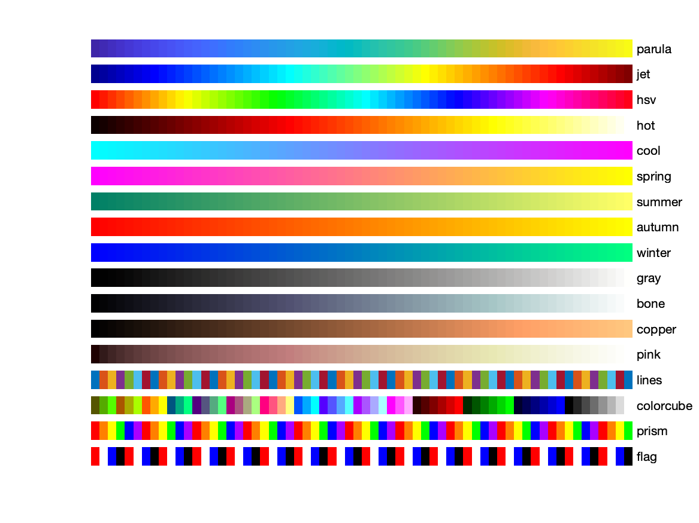

# Git/GitHub Workshop with Mandelbrot in MATLAB

## Mandelbrot

[](https://www.youtube.com/watch?v=8SWFx5vINKM)

## Workshop Overview

Welcome to the Git/GitHub Workshop! In this session, you'll learn the fundamentals of Git and GitHub by contributing to a Mandelbrot renderer project. You will fork the repository, add custom zoom and color settings to a JSON file, and submit your changes through a pull request. By the end of this workshop, you'll have hands-on experience with essential Git/GitHub workflows.

## Prerequisites

Before you begin, ensure you have the following:

- A GitHub account
- Git installed on your computer
- MATLAB installed on your computer
- Basic understanding of Git/GitHub (helpful but not required)

## Workshop Objectives

By the end of this workshop, you will:

1. Understand how to fork a repository on GitHub.
2. Learn to clone a repository to your local machine.
3. Create a new branch for your changes.
4. Add custom zoom and color settings to a JSON file.
5. Commit and push your changes to GitHub.
6. Create a pull request to merge your changes into the main project.
7. Understand how to modify and run the provided MATLAB script for rendering the Mandelbrot set.

## Getting Started

### 1. Fork the Repository

1. Go to the [Mandelbrot Renderer repository](https://github.com/your-username/mandelbrot-renderer).
2. Click on the "Fork" button at the top right of the page to create a copy of the repository under your GitHub account.

### 2. Clone the Repository

1. Open your terminal or command prompt.
2. Clone your forked repository to your local machine using the following command:

```bash
git clone https://github.com/your-username/mandelbrot-renderer.git
```

3. Navigate to the repository directory:

```bash
cd git_workshop/src/
```

### 3. Create a New Branch

1. Create a new branch for your changes:

```bash
git checkout -b add-zoom-color-settings
```

### 4. Add Your Zoom and Color Settings

1. Open the `settings.json` file in your preferred text editor.
2. Add your custom zoom and color settings to the JSON file. Example format:

```json
{
  "settings": [
    {
      "xlim": [-0.748766713922161, -0.748766707771757],
      "ylim": [0.123640844894862, 0.123640851045266],
      "maxIterations": 500,
      "gridSize": 1000,
      "colorMap": "jet"
    },
    {
      "xlim": [-0.5, 0.5],
      "ylim": [-0.5, 0.5],
      "maxIterations": 1000,
      "gridSize": 500,
      "colorMap": "hot"
    }
  ]
}
```

3. Save the file.

### 5. Commit and Push Your Changes

1. Add the modified file to the staging area:

```bash
   git add settings.json
```

2. Commit your changes with a descriptive message:

```bash
git commit -m "Added custom zoom and color settings"
```

3. Push your changes to your forked repository:

```bash
git push
```

### 6. Create a Pull Request

1. Go to your forked repository on GitHub.
2. Click on the "Compare & pull request" button.
3. Provide a title and description for your pull request, then click "Create pull request".

### 7. Running the Mandelbrot Renderer

1. Open MATLAB.
2. Navigate to the directory where you cloned the repository.
3. Open the `mandelbrot_render.m` script.
4. Modify the script to load the settings from `settings.json` and apply them to the rendering process.
5. Run the script to see the Mandelbrot set with your custom settings.

## Conclusion

Congratulations! You've successfully contributed to the Mandelbrot renderer project using Git and GitHub, and learned how to modify and run a MATLAB script for rendering the Mandelbrot set. This hands-on experience has covered essential Git/GitHub workflows and practical MATLAB usage.

## General Resources

- [MATLAB and Simulink for Students GitHub](https://github.com/mathworks/awesome-matlab-students)
- [Git Documentation](https://git-scm.com/doc)
- [GitHub Guides](https://guides.github.com/)
- [Mandelbrot Set Wikipedia](https://en.wikipedia.org/wiki/Mandelbrot_set)
- [MATLAB Mandelbrot Set Example](https://www.mathworks.com/help/parallel-computing/mandelbrot-set.html)

## Workshop Resources

- [MATLAB AI Playground](https://www.mathworks.com/matlabcentral/playground/new)
- [Open in MATLAB Badge](https://www.mathworks.com/products/matlab-online/git.html)

  **Colormaps:**
  

## If you have any questions or need further assistance, feel free to ask during the workshop. Happy coding!
